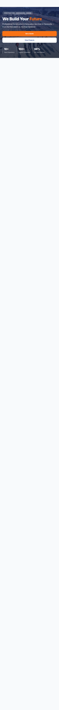

# BuildPro Construction

A responsive, multi-page website template for a construction company. BuildPro presents company information, services, completed projects, and contact options in a clean static site that can be deployed without a build step or server-side runtime.

## Preview

<details>
  <summary>View the full home page</summary>
  <br />
  
</details>

## Features

- Five responsive pages covering the home, company, services, projects, and contact experiences
- Mobile navigation with outside-click, link-selection, and <kbd>Escape</kbd>-key handling
- Filterable residential and commercial project gallery
- Scroll-based reveal animations with a fallback for browsers without `IntersectionObserver`
- Semantic landmarks, skip links, descriptive image text, and visible navigation state
- Reusable CSS variables, layouts, components, and responsive breakpoints
- Quote and contact forms prepared for a Formspree endpoint
- Lazy-loaded remote images and an embedded office map

## Built With

- HTML5
- CSS3
- Vanilla JavaScript
- [Google Fonts](https://fonts.google.com/) (Inter)
- [Unsplash](https://unsplash.com/) demo photography
- [Formspree](https://formspree.io/) form integration placeholder

## Project Structure

```text
build-construction/
├── assets/
│   ├── css/
│   │   ├── base.css          # Design tokens, reset, and global elements
│   │   ├── components.css    # Buttons, cards, forms, and reusable UI
│   │   ├── layout.css        # Header, navigation, footer, and grids
│   │   ├── main.css          # Stylesheet entry point
│   │   ├── responsive.css    # Responsive breakpoints
│   │   └── sections.css      # Page and section-specific styles
│   └── js/
│       ├── main.js           # Navigation, header, and reveal behavior
│       └── projects-filter.js # Project category filtering
├── pages/
│   ├── about.html
│   ├── contact.html
│   ├── projects.html
│   └── services.html
├── check-about.png           # About page preview
├── homepage-desktop.png      # Full home page preview
├── index.html
└── README.md
```

## Getting Started

No package installation or compilation is required.

### Option 1: Open the site directly

Clone the repository and open `index.html` in a browser:

```bash
git clone <repository-url>
cd build-construction
```

### Option 2: Run a local server

Serving the directory is recommended because it more closely matches a deployed environment. For example, with Python 3:

```bash
python3 -m http.server 8000
```

Then visit [http://localhost:8000](http://localhost:8000).

You can also use an editor extension such as VS Code Live Server.

## Pages

| Page | File | Purpose |
| --- | --- | --- |
| Home | `index.html` | Introduces the company, services, featured work, and quote form |
| About | `pages/about.html` | Presents the company story, values, and team |
| Services | `pages/services.html` | Describes the available construction and design services |
| Projects | `pages/projects.html` | Displays projects with client-side category filters |
| Contact | `pages/contact.html` | Provides contact details, inquiry form, hours, and map |

## Customization

### Brand and contact information

Search the HTML files for the sample company name, phone number, email address, and office address, then replace them with the appropriate business details.

### Form submissions

Both forms currently use a placeholder action:

```html
action="https://formspree.io/f/your-form-id"
```

Create a Formspree form and replace `your-form-id` in `index.html` and `pages/contact.html`. Until this value is configured, the forms will not deliver submissions.

### Theme

Update the custom properties in `assets/css/base.css` to change the core visual theme. The primary variables include:

```css
--primary;
--secondary;
--bg;
--text;
```

### Images

The demo pages load photography from Unsplash. Replace those URLs in the HTML with optimized local assets or your preferred image host before deploying a production site.

## Deployment

Because the project is fully static, it can be hosted on GitHub Pages, Netlify, Cloudflare Pages, Vercel, or any standard web server. Publish the repository root so that `index.html` remains the site entry point.

## Notes

- An internet connection is required to load the Google Font, Unsplash images, map, and Formspree service.
- The repository does not include a backend, database, dependency manager, or automated test suite.
- Update all placeholder business content and third-party integrations before production use.
